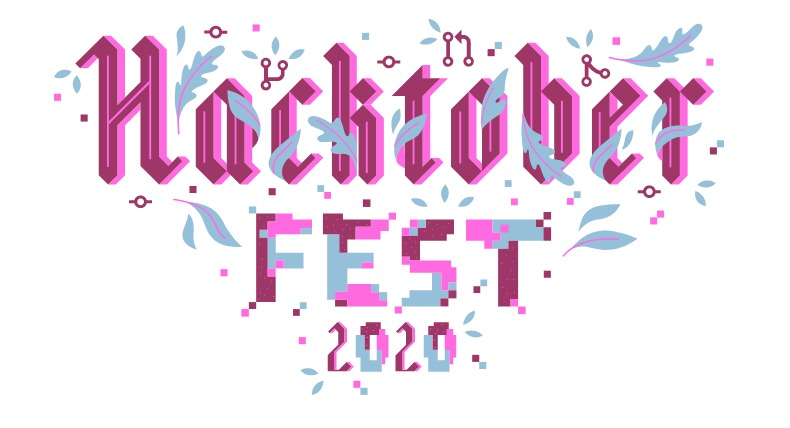

# ---Hacktoberfest2020---

Make your first Pull Request and earn a free tee from GitHub!

# Welcome to GitHub!

## This project is perfect for your first pull request

## Instructions-

- Fork this Repository using the button at the top
- Clone your forked repository to your pc ( git clone "url from clone option.)
- Create a new branch for your modifications (ie. `git branch new-user` and check it out `git checkout new-user` and `git checkout -b new-user`)
- Make your changes
- Add your files (`git add -A`), commit (`git commit -m "ADDED_FILES"`) and push (`git push origin new-user`)
- Create a pull request
